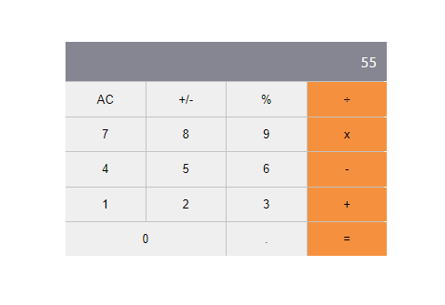

# Math-Magicians
> Math-magicians is a web app for all fans of mathematics. It is a Single Page App (SPA) that allows users to make simple calculations and also read random math-related quotes.

## Built With

- React

## Live demo

[Heroku Live link](https://my--math--magicians.herokuapp.com/)  
[Netlify Live link](https://affectionate-mccarthy-0f6d73.netlify.app)

## Getting Started

### To get a local copy run the following steps:

- Copy this link `https://github.com/elyor-doniyorov/my-math-magicians.git`
- Open your terminal or command line
- Run `git clone` and paste the link
- Open the folder with your code editor
- Create a branch to work on
- Run `npm install`
- Run `npm run build`
- Run `npm start` to launch the server.

## Author

👤 **Elyor Doniyorov**

- Github: [@elyor-doniyorov](https://github.com/elyor-doniyorov)
- LinkedIn: [@elyor-doniyorov](www.linkedin.com/in/elyor-doniyorov)

## 🤝 Contributing

Contributions, issues, and feature requests are welcome!

Feel free to check the [issues page](https://github.com/elyor-doniyorov/my-math-magicians/issues).

## Show your support

Give a ⭐️ if you like this project!

## Acknowledgments

- Learning partners, Standup and morning session team
